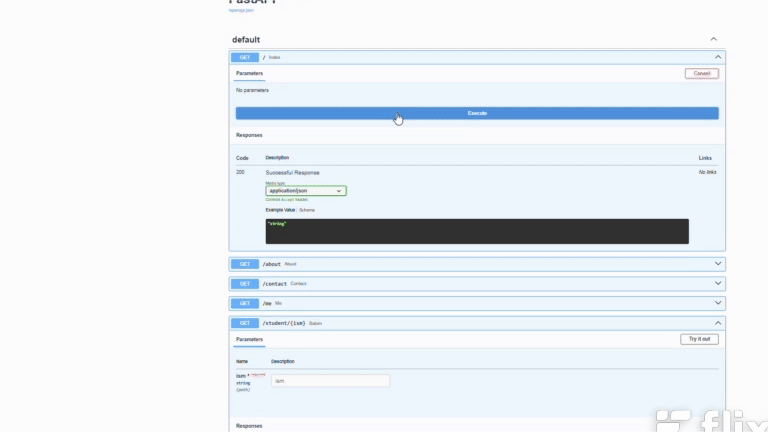

# FastAPI Mini Project

Bu kichik FastAPI loyihasi quyidagi endpointlarga ega:

## 🔗 API Yo'llari

-   `/` --- Asosiy bo'lim\
-   `/about` --- About sahifa\
-   `/contact` --- Contact sahifa\
-   `/me` --- Shaxsiy sahifa\
-   `/student/{ism}` --- Path parameter orqali ism qabul qiladi\
-   `/qidir?s=...` --- Query parameter orqali qidiruv

------------------------------------------------------------------------

## ▶️ Loyiha qanday ishlaydi (video)

Quyidagi video orqali loyiha qanday ishlashini ko'rishingiz mumkin:



------------------------------------------------------------------------

## 🚀 Loyihani ishga tushirish

1.  Kerakli paketlarni o'rnating:

```{=html}
<!-- -->
```
    pip install fastapi "uvicorn[standard]"

2.  Serverni ishga tushiring:

```{=html}
<!-- -->
```
    uvicorn main:app --reload

3.  Brauzerda oching:

```{=html}
<!-- -->
```
    http://127.0.0.1:8000

------------------------------------------------------------------------

## 📁 Fayl tuzilmasi

    /project-folder
    │── main.py
    │── video.mp4
    │── README.md
    